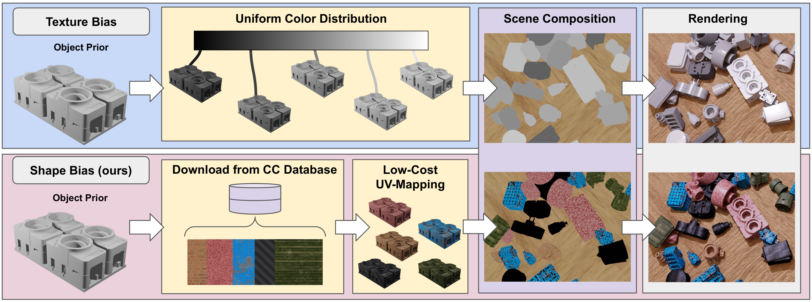

<h1 align="center">
On Texture Randomization and its Relation to Object Detection and 6D
Pose Estimation
</h1>

<h3>
<a href="https://github.com/hoenigpeter">Peter Hönig</a>,
<a href="https://github.com/sThalham">Stefan Thalhammer</a>,
<a href="https://github.com/jibweb">Jean-Baptiste Weibel</a>,
<a href="https://github.com/hirschmanner">Matthias Hirschmanner</a>,
<a href="http://github.com/v4r-tuwien">Markus Vincze</a>,
 
 
</h3>

# Datasets
- To generate the randomized texturing dataset in the BOP format either download them from: PLACEHOLDER111
- or use our rendering scripts provided in ./blenderproc_rendering
- to use the rendering scripts, Blenderproc is necessary: https://github.com/DLR-RM/BlenderProc.git
- copy & paste the scripts to /Blenderproc/examples/datasets/bop_challenge
- and execute e.g. with: `python rerun.py run examples/datasets/bop_challenge/main_tless_random_texture.py ../datasets resources/cc_textures examples/datasets/bop_challenge/output --num_scenes=1000`

# Object Detection and Pose Estimation Software
We used the following list of algorithms:
- YOLOx: https://github.com/shanice-l/gdrnpp_bop2022
- Pix2Pose: https://github.com/kirumang/Pix2Pose
- GDR-Net: https://github.com/THU-DA-6D-Pose-Group/GDR-Net
